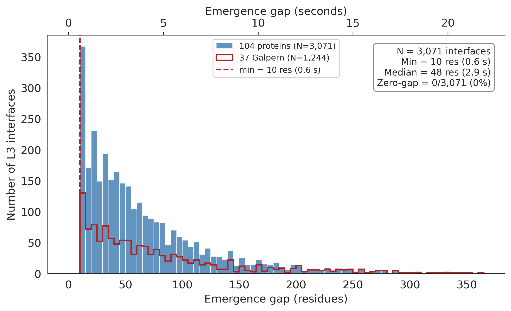
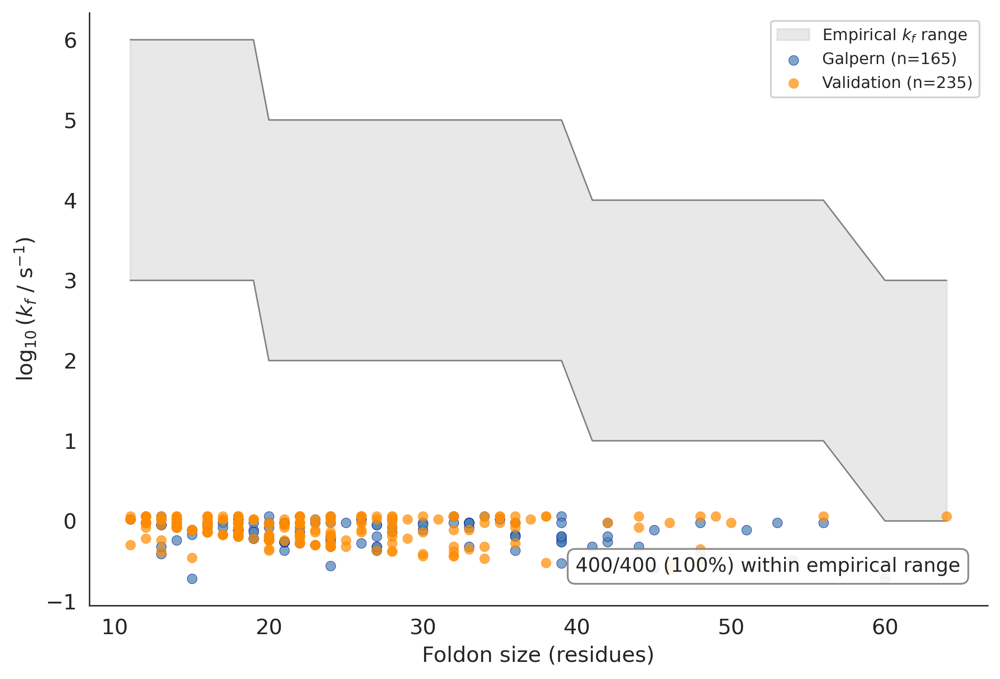
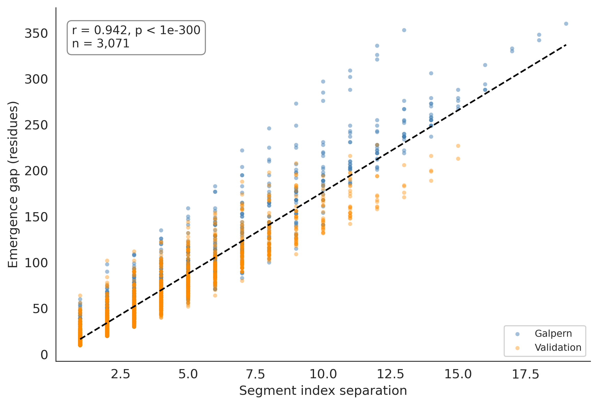
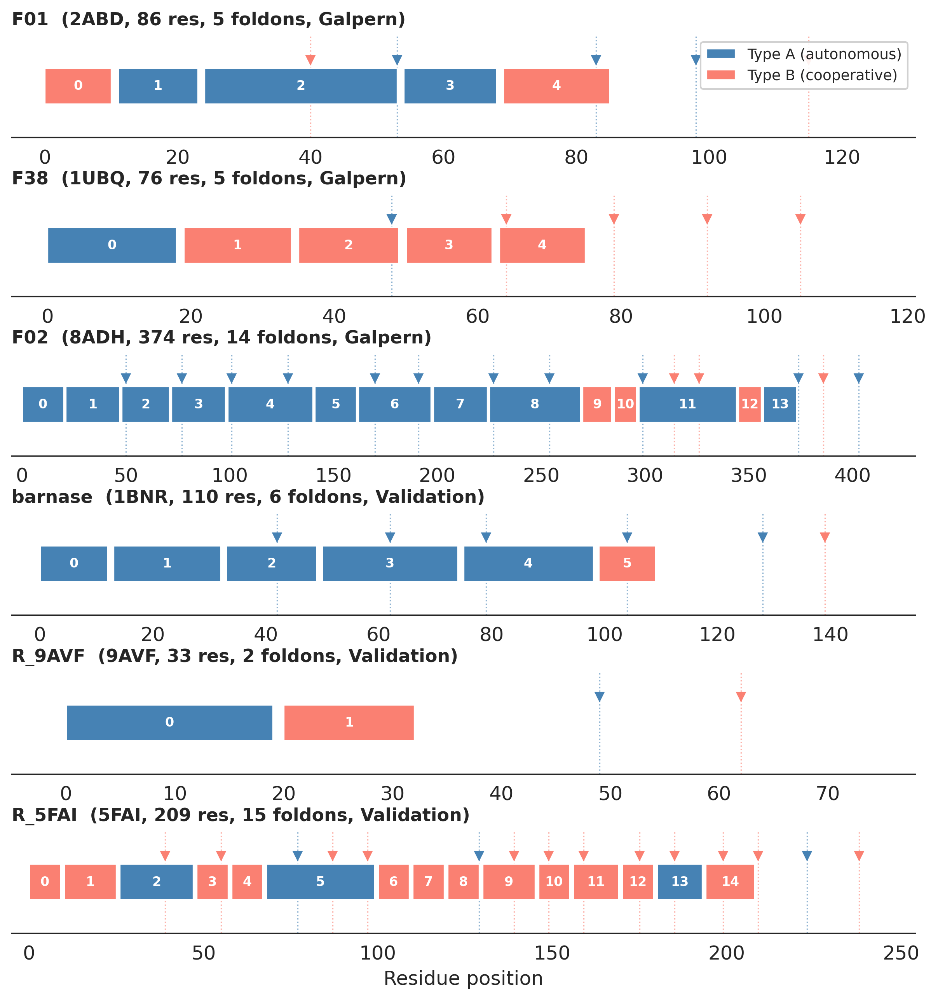
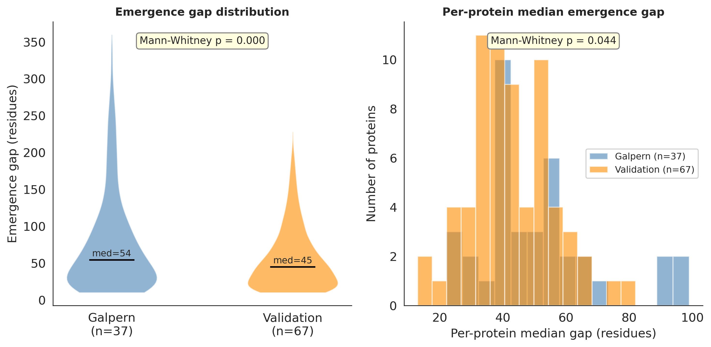

# Codon Project

How does protein architecture interact with co-translational folding? This project tests whether the modular layer structure of proteins — autonomous intra-foldon cores (L2) and cooperative inter-foldon interfaces (L3) — is inherently compatible with the ribosome's vectorial N→C synthesis.

## Key finding

**The protein layer architecture is a construction plan.** Every inter-foldon (L3) interface across 104 proteins has a positive emergence gap — the earlier foldon always clears the ribosome exit tunnel before the interface becomes geometrically possible. This is a parameter-free geometric property: no kinetic parameters are needed.

| metric | 104 proteins |
|--------|-------------|
| L3 interfaces tested | 3,071 |
| zero-gap interfaces | **0 (0%)** |
| median emergence gap | 48 residues (2.9 s) |
| min emergence gap | 10 residues (0.6 s) |
| type A foldons within empirical k_f | **400/400 (100%)** |
| proteins with valid temporal ordering | **104/104 (100%)** |

The safety margin between required and empirical folding rates spans **3–6 orders of magnitude**.

## Figures

### Emergence gap distribution
All 3,071 L3 interfaces have positive emergence gaps. The 37-protein Galpern set (red outline) generalizes to the full 104-protein dataset.



### Minimum k_f required vs empirical range
Each point is a type A foldon. The gray band shows empirical folding rates for fragments of that size. All 400 foldons require a k_f far below the empirical range — folding is trivially fast relative to translation.



### Emergence gap vs segment separation
Strong linear relationship (r = 0.94): the emergence gap is a simple geometric consequence of sequence-contiguous foldon placement.



### Folding timelines
Six example proteins (3 Galpern, 3 validation) showing type A (autonomous, blue) and type B (cooperative, salmon) foldons along the sequence. Triangles mark emergence from the ribosome tunnel.



### Galpern vs validation comparison
Validation proteins have slightly tighter emergence gaps (median 45 vs 54 residues, Mann-Whitney p = 0.044) but the result holds universally: 0 zero-gap interfaces in either set.



## Background

### The (mu, tAI) codon framework

Every codon has two measurable properties:
- **mu** (mistranslation rate): probability of amino acid misincorporation per codon per translation event
- **tAI** (tRNA Adaptation Index): decoding speed based on tRNA gene copy numbers

These define 4 codon modes per amino acid (Q1: safe+fast, Q2: safe+slow, Q3: risky+fast, Q4: risky+slow). This framework was developed in the [proteostasis law project](https://github.com/khatvangi/proteostasis_law) and tested against protein structural layers in the foldon project.

### Protein layer architecture

Proteins have a modular folding architecture:
- **L2 (intra-foldon)**: contacts within a folding segment. Thermodynamically favorable. These define autonomous folding units.
- **L3 (inter-foldon)**: contacts between folding segments. Thermodynamically unfavorable on average. These are cooperative interfaces.
- **Type A foldons**: have L2 contacts — can fold autonomously
- **Type B foldons**: no L2 contacts — structured only through L3 interfaces with neighboring type A foldons

### What was already tested (and failed)

The foldon project tested whether codon selection differs between L2 and L3 positions:
- Same-amino-acid mode switching test: **negative** (p = 0.43 for mu, p = 0.48 for tAI)
- The codon axis is closed for structural layers — organisms do not select different codons for L2 vs L3 positions

**This project asks the next question**: even without codon-level signals, does the *architecture itself* ensure proper co-translational folding order?

### The emergence gap argument

The answer is yes, by geometry:
1. The ribosome synthesizes proteins N→C, one codon at a time (~60 ms/codon in *E. coli*)
2. Each foldon emerges from the exit tunnel (~30 residues) as a contiguous block
3. Foldon-sized fragments (10–40 residues) fold in microseconds — 10³–10⁶ faster than translation
4. Therefore, each foldon folds essentially instantly upon emergence
5. For any L3 interface between foldons A and B, the earlier foldon has already folded by the time the later one emerges

The **emergence gap** = |seg_end_A − seg_end_B| residues. If this is always positive, the temporal ordering is guaranteed by architecture alone — no kinetic fine-tuning needed.

## Project structure

```
codon_project/
├── README.md
├── CLAUDE.md                          # project context
├── codon_error_rates.tsv              # per-codon mu values (61 codons)
├── ecoli_tai_ws.tsv                   # per-codon tAI values (60 codons)
├── codon_modes_ecoli.tsv              # E. coli codon mode assignments
├── aa_mode_summary.tsv                # per-AA mode counts
├── global_codon_usage.tsv             # global codon usage frequencies
├── docs/plans/                        # design and implementation plans
└── cotrans-layer/                     # main analysis
    ├── src/                           # source modules
    │   ├── utils.py                   # shared utilities, data loaders
    │   ├── kinetic_model.py           # O'Brien two-state model (superseded)
    │   ├── contact_analysis.py        # per-foldon contact extraction
    │   ├── rate_computation.py        # tAI/uniform/shuffled rate regimes
    │   └── cds_mapping.py            # PDB→SIFTS→UniProt→EMBL→NCBI CDS pipeline
    ├── scripts/
    │   ├── 01_build_manifest.py       # 37-protein manifest
    │   ├── 02_fetch_cds.py            # CDS sequence retrieval (32/37 success)
    │   ├── 03_run_kinetic_model.py    # kinetic model (superseded by geometric analysis)
    │   ├── 04_analyze_layers.py       # 37-protein emergence gap analysis
    │   ├── 05_generate_figures.py     # 37-protein figures
    │   ├── 06_extend_to_full_dataset.py  # 104-protein extension
    │   └── 07_generate_figures_104.py # 104-protein figures
    ├── tests/                         # 13 passing tests
    ├── data/
    │   ├── protein_manifest.csv       # 37 Galpern proteins
    │   └── extended_segment_types.csv # 949 segments across 104 proteins
    └── results/
        ├── summary/                   # 37-protein results
        ├── summary_104/               # 104-protein results
        ├── figures/                   # 37-protein figures (PNG + PDF)
        └── figures_104/               # 104-protein figures (PNG + PDF)
```

## Data sources

The analysis depends on upstream data from the foldon project:
- **segment_types.csv**: foldon boundaries for 59 proteins
- **energy_decomposition.csv**: per-contact L2/L3 layer assignments for 104 proteins
- **contacts_awsem.csv**: AWSEM contact energies for 37 Galpern proteins
- **scan_result.json**: foldon boundary predictions from AWSEM for validation proteins
- **table_s1_all_proteins.csv**: master list of 105 proteins

## How to reproduce

```bash
# 37-protein analysis
python cotrans-layer/scripts/04_analyze_layers.py
python cotrans-layer/scripts/05_generate_figures.py

# 104-protein extension
python cotrans-layer/scripts/06_extend_to_full_dataset.py
python cotrans-layer/scripts/07_generate_figures_104.py

# tests
python -m pytest cotrans-layer/tests/ -v
```

Requires: numpy, pandas, scipy, matplotlib, seaborn, biopython.

Upstream data paths are hardcoded to the local filesystem and would need adjustment for a different machine.

## Why the kinetic model was superseded

The original plan used the Plaxco contact-order → k_f relation to predict folding rates for each foldon. This failed because:

1. **Plaxco relation breaks for small fragments**: calibrated on whole proteins (50–150 residues, CO 0.05–0.25), but foldons have CO 0.6–0.9, giving absurdly slow k_f
2. **The failure is actually the answer**: foldon-sized fragments fold in microseconds, translation takes ~60 ms/codon. Folding is 10³–10⁶ faster. The kinetic model becomes trivial (P_folded ≈ 1 within one codon of emergence)
3. **The relevant variable is geometry, not kinetics**: the emergence gap is parameter-free and sufficient

The kinetic model code is preserved in `scripts/03_run_kinetic_model.py` for reference.
