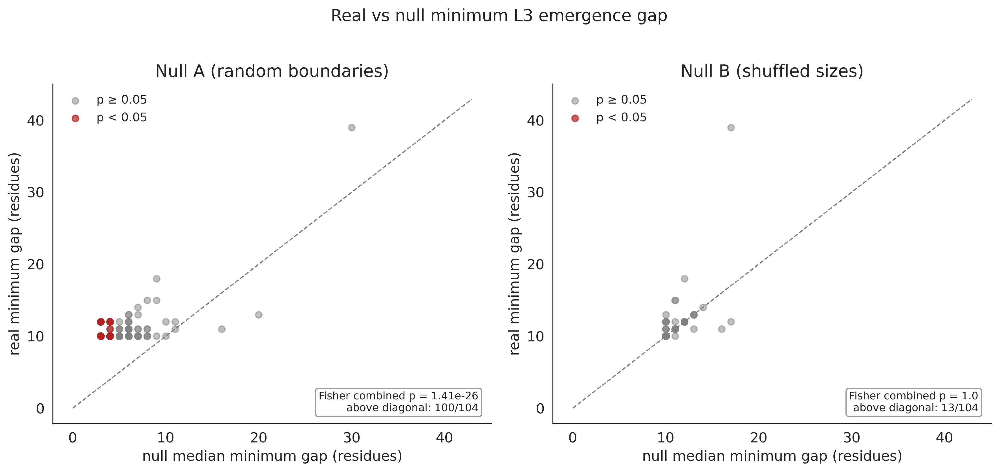
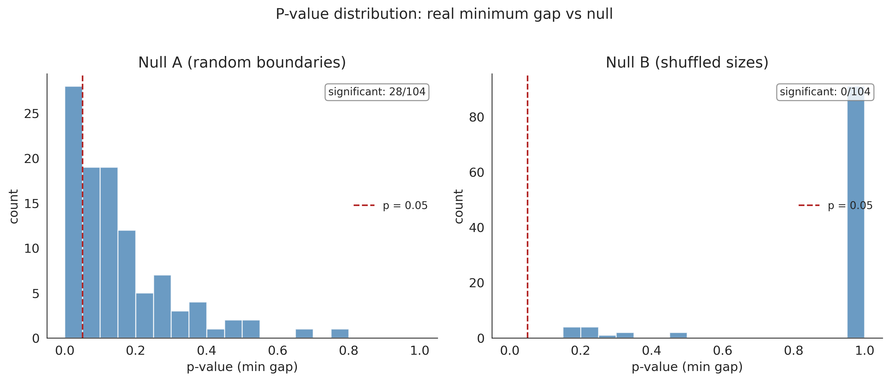

# Foldon Geometry and Co-translational Folding

Does protein modular architecture happen to be compatible with the ribosome's vectorial N-to-C synthesis? This project tests whether the sequential emergence of foldons from the ribosome exit tunnel preserves a temporal ordering consistent with co-translational folding, using a simplified geometric model.

## Background: why this question was asked

### The (mu, tAI) codon framework

Every codon has two measurable properties:
- **mu** (mistranslation rate): probability of amino acid misincorporation per codon per translation event
- **tAI** (tRNA Adaptation Index): decoding speed based on tRNA gene copy numbers

These define 4 codon modes per amino acid (Q1: safe+fast, Q2: safe+slow, Q3: risky+fast, Q4: risky+slow). This framework was developed in the [proteostasis law project](https://github.com/khatvangi/proteostasis_law) and tested against protein structural layers in the foldon project.

### The codon signal is absent

The foldon project tested whether codon selection differs between intra-foldon (L2) and inter-foldon (L3) positions:
- Same-amino-acid mode switching test: **negative** (p = 0.43 for mu, p = 0.48 for tAI)
- Organisms do not select different codons for L2 vs L3 positions

This negative result motivated the present question: even without active codon-level modulation, is the *geometry* of foldon architecture already compatible with vectorial synthesis?

### Protein layer architecture

Proteins have a modular folding architecture:
- **L2 (intra-foldon)**: contacts within a folding segment. Thermodynamically favorable. These define autonomously foldable units.
- **L3 (inter-foldon)**: contacts between folding segments. Thermodynamically unfavorable on average. These are cooperative interfaces.
- **Type A foldons** (model-derived): segments with L2 contacts, classified as capable of autonomous folding under the AWSEM energy decomposition model
- **Type B foldons** (model-derived): segments lacking L2 contacts, classified as structured only through L3 interfaces with neighboring type A foldons

Note: the type A/B classification derives from the AWSEM coarse-grained energy model and its foldon segmentation algorithm. It reflects model-predicted behavior, not directly measured folding autonomy.

---

## Layer 1: the geometric observation

### The emergence gap

For any L3 interface between two foldons, the **emergence gap** is defined as the absolute difference in their segment-end positions: gap = |seg_end_i - seg_end_j| residues. Because foldons are contiguous segments in the sequence, the earlier foldon's C-terminus always precedes the later foldon's C-terminus.

**Key clarification**: the positivity of all gaps is tautological for any contiguous segmentation of a linear sequence. The non-trivial question is whether the *magnitudes* of these gaps — determined by the energetically optimized segment sizes — are large enough to be biologically meaningful.

### Results across 104 proteins

| metric | value |
|--------|-------|
| proteins analyzed | 104 |
| L3 interfaces tested | 3,071 |
| median emergence gap | 48 residues |
| minimum emergence gap | 10 residues |

The 37-protein Galpern set (median gap 54 residues) generalizes to the full 104-protein dataset (median gap 48 residues). Validation proteins have slightly tighter gaps (Mann-Whitney p = 0.044), but the distribution is qualitatively similar.

---

## Layer 2: the kinetic interpretation

Converting emergence gaps to time estimates requires literature-based assumptions:

- **Translation rate**: ~60 ms per codon in *E. coli* (literature value)
- **Tunnel length**: ~30 residues (literature value, though the gap metric is independent of this — see Limitations)
- **Foldon folding rates**: empirical k_f ranges for fragments of 10-40 residues (microsecond timescale, from published data)

Under these assumptions, the median emergence gap of 48 residues corresponds to ~2.9 seconds, while foldon-sized fragments are expected to fold in microseconds. This yields an estimated safety margin of 3-6 orders of magnitude between required and empirical folding rates.

| metric | value |
|--------|-------|
| type A foldons assessed | 400 |
| foldons with k_f,required below empirical range | 400/400 (100%) |

This kinetic plausibility check supports — but does not prove — that foldon architecture is compatible with co-translational folding. The safety margin is large enough that even substantial errors in the assumed rates would not change the qualitative conclusion.

---

## Null model analysis

The positivity of all emergence gaps is a geometric tautology for contiguous segmentations. To test whether the *magnitudes* are non-trivial, we compare real foldons against two null models (1000 permutations each):

### Null A: random k-partitions (same number of segments, random boundaries)

Real foldons produce significantly larger minimum gaps than random contiguous partitions of the same sequence into the same number of segments.

| metric | value |
|--------|-------|
| Fisher combined p-value | 1.4e-26 |
| proteins with real min gap > null median | 100/104 (96%) |
| proteins individually significant (p < 0.05) | 28/104 |

### Null B: shuffled segment sizes (same sizes, random order)

No difference. When the real segment sizes are preserved but their sequential order is shuffled, the minimum gaps are indistinguishable from the real data.

| metric | value |
|--------|-------|
| Fisher combined p-value | 1.0 |
| proteins with real min gap > null median | 13/104 (12.5%) |
| proteins individually significant (p < 0.05) | 0/104 |

### Interpretation

The advantage of real foldons over random partitions comes entirely from the segment sizes, which are determined by the AWSEM energetic optimization. The sequential ordering of those sized segments does not contribute additional advantage. This means: given the segment sizes that energy optimization selects, *any* contiguous arrangement would produce similarly large gaps. The non-trivial content is in the size distribution, not the arrangement.

### Null model figures

**Figure 6**: Real vs null minimum gaps. Left: Null A (random boundaries) — most proteins fall above the diagonal. Right: Null B (shuffled sizes) — proteins scatter around the diagonal.



**Figure 7**: P-value distributions for minimum gap comparisons. Left: Null A shows enrichment of small p-values. Right: Null B shows a uniform distribution (no signal).



---

## Figures

### Emergence gap distribution
All 3,071 L3 interfaces have positive emergence gaps. The 37-protein Galpern set (red outline) generalizes to the full 104-protein dataset.


### Minimum k_f required vs empirical range
Each point is a type A foldon. The gray band shows empirical folding rates for fragments of that size (literature values). All 400 foldons require a k_f far below the empirical range — presented as plausibility support for co-translational folding compatibility, not as proof.


### Emergence gap vs segment separation
Strong linear relationship (r = 0.94): the emergence gap is a direct geometric consequence of sequence-contiguous foldon placement. This linearity reflects the tautological component — the interesting question is the magnitude (addressed by the null models above).


### Folding timelines
Six example proteins (3 Galpern, 3 validation) showing type A (autonomous, blue) and type B (cooperative, salmon) foldons along the sequence. Triangles mark emergence from the ribosome tunnel.


### Galpern vs validation comparison
Validation proteins have slightly tighter emergence gaps (median 45 vs 54 residues, Mann-Whitney p = 0.044) but both sets show the same qualitative pattern.


---

## Consistency check: temporal ordering

All 104/104 proteins satisfy the condition that every L3 interface has a positive emergence gap. As noted above, this is expected by construction for any contiguous segmentation and should be treated as a consistency check, not as an independent finding.

## Tunnel-length sensitivity

The gap metric (|seg_end_i - seg_end_j|) is independent of tunnel length by construction — changing the assumed tunnel length shifts both segment emergence points equally and does not affect the gap. The sensitivity table below confirms this but should not be cited as evidence of robustness, since it is a consequence of the metric definition.

| tunnel | median gap (res) | foldons within k_f | temporal OK |
|--------|-----------------|-------------------|-------------|
| 25 | 48 | 400/400 (100%) | 104/104 (100%) |
| 30 | 48 | 400/400 (100%) | 104/104 (100%) |
| 40 | 48 | 400/400 (100%) | 104/104 (100%) |

---

## Limitations

This analysis uses a simplified geometric model and does not capture several factors that are known to influence co-translational folding:

- **Tunnel-specific folding**: some proteins begin folding inside the ribosome exit tunnel, where the confined geometry alters folding pathways. Our model assumes folding begins only upon full emergence.
- **Ribosome-surface effects**: the ribosome surface near the exit port can stabilize or destabilize nascent chain conformations. This is not modeled.
- **Chaperones**: trigger factor, DnaK/DnaJ, and other chaperones interact with the nascent chain and modulate folding kinetics. These effects are absent from the geometric model.
- **Slow-translating regions**: codon usage, mRNA secondary structure, and ribosome pausing create non-uniform translation rates. Our model assumes constant translation speed.
- **Multidomain kinetic traps**: for multidomain proteins, partially folded intermediates can misfold or aggregate. The model treats each foldon independently.
- **Model dependence**: the type A/B classification and foldon boundaries derive from the AWSEM coarse-grained energy model. Different foldon definitions could yield different results.
- **Parameter-light, not parameter-free**: while the geometric observation (gap positivity and magnitude) does not require kinetic parameters, the biologically interesting interpretation (time margins, folding rate comparisons) relies on literature-derived translation rates and empirical folding rate ranges.

---

## Project structure

```
codon_project/
├── README.md
├── CLAUDE.md                          # project context
├── codon_error_rates.tsv              # per-codon mu values (61 codons)
├── ecoli_tai_ws.tsv                   # per-codon tAI values (60 codons)
├── codon_modes_ecoli.tsv              # E. coli codon mode assignments
├── aa_mode_summary.tsv                # per-AA mode counts
├── global_codon_usage.tsv             # global codon usage frequencies
├── docs/plans/                        # design and implementation plans
└── cotrans-layer/                     # main analysis
    ├── src/                           # source modules
    │   ├── utils.py                   # shared utilities, data loaders
    │   ├── kinetic_model.py           # O'Brien two-state model (superseded)
    │   ├── contact_analysis.py        # per-foldon contact extraction
    │   ├── rate_computation.py        # tAI/uniform/shuffled rate regimes
    │   └── cds_mapping.py            # PDB→SIFTS→UniProt→EMBL→NCBI CDS pipeline
    ├── scripts/
    │   ├── 01_build_manifest.py       # 37-protein manifest
    │   ├── 02_fetch_cds.py            # CDS sequence retrieval (32/37 success)
    │   ├── 03_run_kinetic_model.py    # kinetic model (superseded by geometric analysis)
    │   ├── 04_analyze_layers.py       # 37-protein emergence gap analysis
    │   ├── 05_generate_figures.py     # 37-protein figures
    │   ├── 06_extend_to_full_dataset.py  # 104-protein extension
    │   ├── 07_generate_figures_104.py # 104-protein figures
    │   └── 09_null_model_figures.py   # null model figures (figures 6 & 7)
    ├── tests/                         # 13 passing tests
    ├── data/
    │   ├── protein_manifest.csv       # 37 Galpern proteins
    │   ├── extended_segment_types.csv # 949 segments across 104 proteins
    │   └── upstream/                  # vendored upstream data files
    │       ├── cds_cache/             # cached CDS sequences
    │       ├── uniprot_cache/         # cached UniProt mappings
    │       ├── contacts_awsem.csv     # AWSEM contact energies (37 proteins)
    │       ├── energy_decomposition.csv # per-contact L2/L3 assignments (104 proteins)
    │       ├── segment_types.csv      # foldon boundaries (59 proteins)
    │       └── table_s1_all_proteins.csv # master protein list
    └── results/
        ├── summary/                   # 37-protein results
        ├── summary_104/               # 104-protein results + null model results
        ├── figures/                   # 37-protein figures (PNG + PDF)
        └── figures_104/               # 104-protein figures (PNG + PDF, 7 figures)
```

## How to reproduce

Upstream data files from the foldon project are vendored in `cotrans-layer/data/upstream/`, so no external path dependencies are needed.

```bash
# 37-protein analysis
python cotrans-layer/scripts/04_analyze_layers.py
python cotrans-layer/scripts/05_generate_figures.py

# 104-protein extension
python cotrans-layer/scripts/06_extend_to_full_dataset.py
python cotrans-layer/scripts/07_generate_figures_104.py

# null model figures
python cotrans-layer/scripts/09_null_model_figures.py

# tests
python -m pytest cotrans-layer/tests/ -v
```

Requires: numpy, pandas, scipy, matplotlib, seaborn, biopython.

## Why the kinetic model was superseded

The original plan used the Plaxco contact-order to k_f relation to predict folding rates for each foldon. This was abandoned because:

1. **Plaxco relation breaks for small fragments**: calibrated on whole proteins (50-150 residues, CO 0.05-0.25), but foldons have CO 0.6-0.9, giving unreasonable k_f predictions
2. **The failure pointed to a simpler framing**: foldon-sized fragments fold in microseconds, translation takes ~60 ms/codon. The timescale separation is so large that detailed kinetic modeling adds complexity without changing the conclusion
3. **The geometric observation is simpler and more transparent**: the emergence gap magnitude, combined with the null model comparison, captures the main finding without requiring a kinetic model

The kinetic model code is preserved in `scripts/03_run_kinetic_model.py` for reference.
